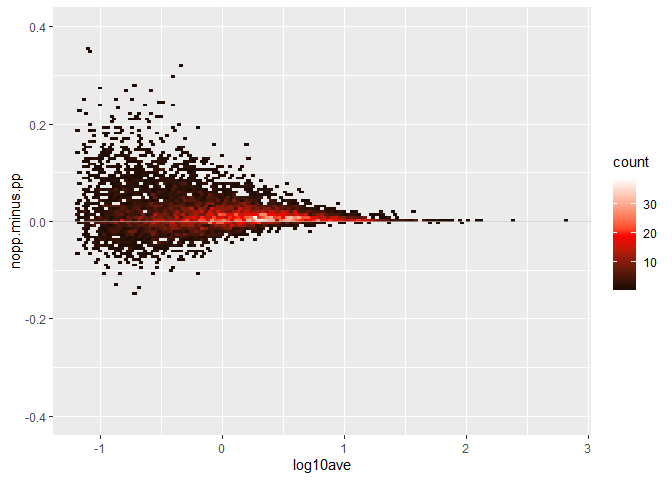
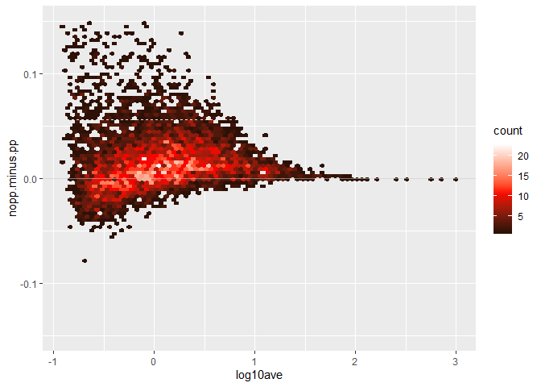
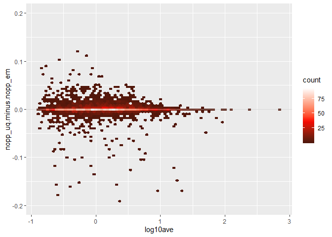

sim.em are not integer

```r
# BiocManager::install("LoomExperiment")
library(LoomExperiment)
```

```
## Loading required package: S4Vectors
```

```
## Loading required package: stats4
```

```
## Loading required package: BiocGenerics
```

```
## Loading required package: parallel
```

```
## 
## Attaching package: 'BiocGenerics'
```

```
## The following objects are masked from 'package:parallel':
## 
##     clusterApply, clusterApplyLB, clusterCall, clusterEvalQ,
##     clusterExport, clusterMap, parApply, parCapply, parLapply,
##     parLapplyLB, parRapply, parSapply, parSapplyLB
```

```
## The following objects are masked from 'package:stats':
## 
##     IQR, mad, sd, var, xtabs
```

```
## The following objects are masked from 'package:base':
## 
##     anyDuplicated, append, as.data.frame, basename, cbind,
##     colnames, dirname, do.call, duplicated, eval, evalq, Filter,
##     Find, get, grep, grepl, intersect, is.unsorted, lapply, Map,
##     mapply, match, mget, order, paste, pmax, pmax.int, pmin,
##     pmin.int, Position, rank, rbind, Reduce, rownames, sapply,
##     setdiff, sort, table, tapply, union, unique, unsplit, which,
##     which.max, which.min
```

```
## 
## Attaching package: 'S4Vectors'
```

```
## The following object is masked from 'package:base':
## 
##     expand.grid
```

```
## Loading required package: SingleCellExperiment
```

```
## Loading required package: SummarizedExperiment
```

```
## Loading required package: GenomicRanges
```

```
## Loading required package: IRanges
```

```
## 
## Attaching package: 'IRanges'
```

```
## The following object is masked from 'package:grDevices':
## 
##     windows
```

```
## Loading required package: GenomeInfoDb
```

```
## Loading required package: Biobase
```

```
## Welcome to Bioconductor
## 
##     Vignettes contain introductory material; view with
##     'browseVignettes()'. To cite Bioconductor, see
##     'citation("Biobase")', and for packages 'citation("pkgname")'.
```

```
## Loading required package: DelayedArray
```

```
## Loading required package: matrixStats
```

```
## 
## Attaching package: 'matrixStats'
```

```
## The following objects are masked from 'package:Biobase':
## 
##     anyMissing, rowMedians
```

```
## Loading required package: BiocParallel
```

```
## 
## Attaching package: 'DelayedArray'
```

```
## The following objects are masked from 'package:matrixStats':
## 
##     colMaxs, colMins, colRanges, rowMaxs, rowMins, rowRanges
```

```
## The following objects are masked from 'package:base':
## 
##     aperm, apply, rowsum
```

```
## Loading required package: rhdf5
```

```
## Loading required package: rtracklayer
```

```r
library(ggplot2)
files <- list.files(".", ".loom")
dat <- list()
nms <- sub("deng.(.*).loom","\\1",files)
for (i in 1:4) {
  dat[[nms[i]]] <- import(files[i])
}
sapply(dat, dim)
```

```
##      full.em full.uq sim.em sim.uq
## [1,]   43346   43346  43346  43346
## [2,]     122     122    122    122
```

```r
lapply(dat, assayNames)
```

```
## $full.em
## [1] "matrix" "B"      "F"     
## 
## $full.uq
## [1] "matrix" "aln_B"  "aln_F"  "uniq_B" "uniq_F"
## 
## $sim.em
## [1] "matrix"   "B"        "F"        "lambda_k" "p_k"      "pi_bk"   
## [7] "pi_mk"    "pi_pk"   
## 
## $sim.uq
##  [1] "matrix"     "aln_B"      "aln_F"      "lambda_k"   "p_k"       
##  [6] "pi_bk"      "pi_mk"      "pi_pk"      "uniq_B"     "uniq_F"    
## [11] "uniq_total"
```

```r
#rows are 43346 genes,columns are 122 cells.
#represent each cell on average have 147538 read counts
mean(colSums(assay(dat[["sim.em"]], "matrix"))) # 147538
```

```
## [1] 147538.4
```

```r
mean(colSums(assay(dat[["full.em"]], "matrix"))) #14753888
```

```
## [1] 14753888
```

```r
assay(dat[["sim.em"]], "p_k")
```

```
## <43346 x 122> DelayedMatrix object of type "double":
##                 [,1]        [,2]        [,3] ...      [,121]      [,122]
##     [1,] 0.304474254 0.001567820 0.003687647   . 0.001580210 0.004124194
##     [2,] 0.000000000 0.000000000 0.000000000   . 0.000000000 0.000000000
##     [3,] 0.474124862 0.336424129 0.997526162   . 0.995847673 0.450826968
##     [4,] 0.000000000 0.000000000 0.000000000   . 0.000000000 0.000000000
##     [5,] 0.000000000 0.000000000 0.000000000   . 0.000000000 0.000000000
##      ...           .           .           .   .           .           .
## [43342,]           0           0           0   .           0           0
## [43343,]           0           0           0   .           0           0
## [43344,]           0           0           0   .           0           0
## [43345,]           0           0           0   .           0           0
## [43346,]           0           0           0   .           0           0
```
uniqe total are integer

```r
# these will be the counts used on the x-axis
counts <- assay(dat[["sim.uq"]], "uniq_total")
uniq.total <- (assay(dat[["full.uq"]], "uniq_F") +
               assay(dat[["full.uq"]], "uniq_B"))
assay(dat[["full.uq"]], "uniq_total") <- uniq.total
```


```r
get.mse <- function(x, y, loc=NULL) {
  # loc is a binary matrix of which locations to use
  if (is.null(loc)) {
    loc <- apply(as.matrix(x), 2, function(z) !is.nan(z))
  }
  s <- rowSums(loc * (as.matrix(x)-as.matrix(y))^2, na.rm=TRUE)
  n <- rowSums(loc)
  s/n
}
#no partial pooling vs partial pooling
calcDiffMSE <- function(nopp, pp, true) {
  mse.nopp <- get.mse(nopp, true)
  loc <- apply(as.matrix(nopp), 2, function(x) !is.nan(x))
  mse.pp <- get.mse(pp, true, loc)
  keep <- rowSums(!is.nan(nopp)) >= 15 & !is.nan(mse.nopp - mse.pp)
  #keep gene location that has difference
  print(sum(keep))
  d <- data.frame(log10ave=log10(cts),
                  nopp.minus.pp=(mse.nopp - mse.pp))
  d <- d[keep,]
  print(with(d, sum(nopp.minus.pp > .05)))
  print(with(d, sum(nopp.minus.pp < -.05)))
  print(with(d, mean(nopp.minus.pp)))
  d
}
```

EM version

What is Rhat_ase and selected


```r
#Rhat_ase represents coverage, selected represent high expressed
idx <- mcols(dat[["sim.em"]])$Rhat_ase < 1.1 &
       mcols(dat[["sim.em"]])$Selected > 0
table(idx)
```

```
## idx
## FALSE  TRUE 
## 36017  7329
```

```r
#get true allelic proportion
true <- (assay(dat[["full.em"]], "F") / assay(dat[["full.em"]], "matrix"))[idx,]
nopp <- (assay(dat[["sim.em"]], "F") / assay(dat[["sim.em"]], "matrix"))[idx,]
pp <- assay(dat[["sim.em"]], "p_k")[idx,]
cts <- rowMeans(counts[idx,])
d <- calcDiffMSE(nopp, pp, true)
```

```
## [1] 7195
## [1] 859
## [1] 121
## [1] 0.01686243
```

```r
ggplot(d, aes(x=log10ave,y=nopp.minus.pp)) + # EM
  geom_hex(bins=120) +
  geom_hline(yintercept=0, alpha=.6,color="grey") +
  ylim(-.4,.4) +
  scale_fill_gradient2(low="black",mid="red",high="white",midpoint=19)
```

```
## Warning: Removed 1 rows containing non-finite values (stat_binhex).
```

<!-- -->

uniq version


```r
idx <- mcols(dat[["sim.uq"]])$Rhat_ase < 1.1 &
       mcols(dat[["sim.uq"]])$Selected > 0
table(idx)
```

```
## idx
## FALSE  TRUE 
## 36478  6868
```

```r
true <- (assay(dat[["full.uq"]], "uniq_F") / assay(dat[["full.uq"]], "uniq_total"))[idx,]
nopp <- (assay(dat[["sim.uq"]], "uniq_F") / assay(dat[["sim.uq"]], "uniq_total"))[idx,]
pp <- assay(dat[["sim.uq"]], "p_k")[idx,]
cts <- rowMeans(counts[idx,])
d <- calcDiffMSE(nopp, pp, true)
```

```
## [1] 5759
## [1] 617
## [1] 3
## [1] 0.01759068
```

```r
ggplot(d, aes(x=log10ave,y=nopp.minus.pp)) + # uniq
  geom_hex(bins=80) +
  geom_hline(yintercept=0, alpha=.6,color="grey") +
  ylim(-.15,.15) +
  scale_fill_gradient2(low="black",mid="red",high="white",midpoint=11)
```

```
## Warning: Removed 9 rows containing non-finite values (stat_binhex).
```

<!-- -->
Method 1 and 2 comparison

```r
idx1 <- mcols(dat[["sim.uq"]])$Rhat_ase < 1.1 &
       mcols(dat[["sim.uq"]])$Selected > 0
idx2 <- mcols(dat[["sim.em"]])$Rhat_ase < 1.1 &
       mcols(dat[["sim.em"]])$Selected > 0
idx3<-idx1&idx2
table(idx3)
```

```
## idx3
## FALSE  TRUE 
## 37947  5399
```

```r
true <- (assay(dat[["full.uq"]], "uniq_F") / assay(dat[["full.uq"]], "uniq_total"))[idx3,]
nopp_uq <- (assay(dat[["sim.uq"]], "uniq_F") / assay(dat[["sim.uq"]], "uniq_total"))[idx3,]
nopp_em <- (assay(dat[["sim.em"]], "F") / assay(dat[["sim.em"]], "matrix"))[idx3,]
cts <- rowMeans(counts[idx3,])
d <- calcDiffMSE(nopp_uq, nopp_em, true)
```

```
## [1] 4672
## [1] 22
## [1] 52
## [1] 0.0001457639
```

```r
ggplot(d, aes(x=log10ave,y=nopp.minus.pp)) + # uniq
  labs(y="nopp_uq.minus.nopp_em")+
  geom_hex(bins=80) +
  geom_hline(yintercept=0, alpha=.6,color="grey") +
  ylim(-.2,.2) +
  scale_fill_gradient2(low="black",mid="red",high="white",midpoint=38)
```

```
## Warning: Removed 5 rows containing non-finite values (stat_binhex).
```

```
## Warning: Removed 2 rows containing missing values (geom_hex).
```

<!-- -->

